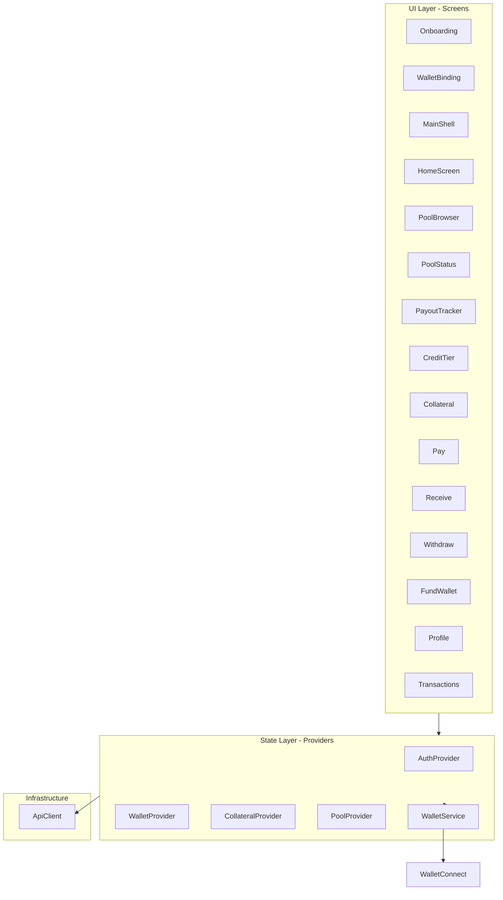
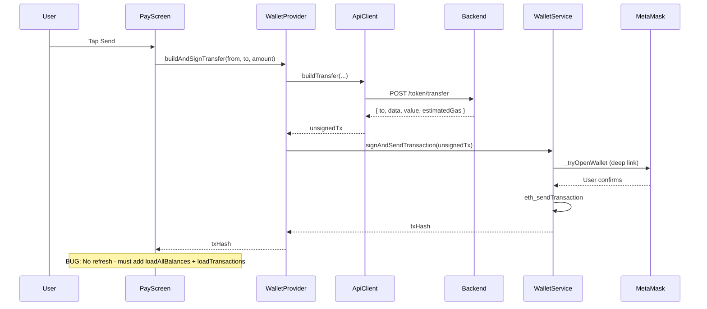
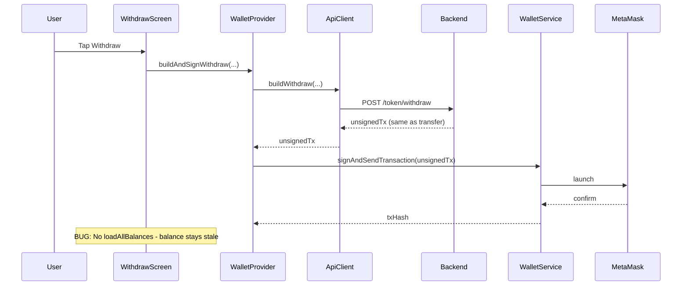
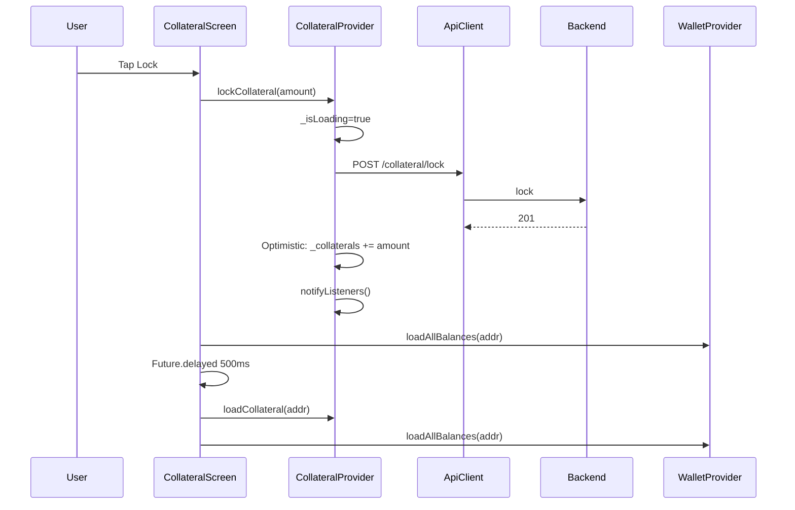

# Diaspora Equb v0.9.1 — Software Requirements Specification and Deployment Plan

## 1. Executive Summary

This document defines the complete SRS and deployment plan for **Diaspora Equb DeFi v0.9.1**, targeting a production-ready, demo-day presentation and revenue-generating stage. All constraints, functional and non-functional requirements, software development stages, and clean architecture standards are specified. **No additional changes are anticipated after this plan is executed.**

**Scope:** Frontend (Flutter), Backend (NestJS), Smart Contracts (Solidity/Hardhat), Infrastructure (Docker, PostgreSQL, Nginx).

---

## 2. Version and Consistency

**Target version: 0.9.1** across all artifacts:


| Artifact    | File                                             | Current | Target |
| ----------- | ------------------------------------------------ | ------- | ------ |
| Frontend    | [frontend/pubspec.yaml](frontend/pubspec.yaml)   | 0.1.0   | 0.9.1  |
| Backend     | [backend/package.json](backend/package.json)     | 0.1.0   | 0.9.1  |
| Contracts   | [contracts/package.json](contracts/package.json) | 0.1.0   | 0.9.1  |
| Swagger     | [backend/src/main.ts](backend/src/main.ts)       | 0.1.0   | 0.9.1  |
| iOS/Android | platform-specific configs                        | 1.0.0   | 0.9.1  |


---

## 3. Functional Requirements (Complete Feature Set)

### 3.1 Identity and Access


| ID    | Requirement                        | Status      | Notes                                           |
| ----- | ---------------------------------- | ----------- | ----------------------------------------------- |
| F-1.1 | Fayda e-ID verification            | Implemented | Mock in dev; real integration required for prod |
| F-1.2 | Identity hash on-chain             | Implemented | IdentityRegistry contract                       |
| F-1.3 | Wallet binding (1:1 with identity) | Implemented | DB + on-chain                                   |
| F-1.4 | JWT authentication                 | Implemented | Guards on all protected routes                  |
| F-1.5 | Dev-login bypass                   | Implemented | **MUST be disabled in production**              |


**Production gate:** `DEV_BYPASS_FAYDA` must be `false`; `dev-login` must be guarded by `NODE_ENV !== 'production'` or removed.

### 3.2 Equb Pool Operations


| ID    | Requirement                                              | Status      | Notes                              |
| ----- | -------------------------------------------------------- | ----------- | ---------------------------------- |
| F-2.1 | Pool creation (tier, contribution, maxMembers, treasury) | Implemented | On-chain + DB                      |
| F-2.2 | Pool browsing with tier filtering                        | Implemented |                                    |
| F-2.3 | Pool join                                                | Implemented | Requires identity + collateral     |
| F-2.4 | Contribution by round                                    | Implemented | On-chain + indexer                 |
| F-2.5 | Round close                                              | Implemented | Auto-freeze on missed contribution |
| F-2.6 | Streamed payout (20–30% upfront)                         | Implemented | PayoutStream contract              |


### 3.3 Collateral and Slashing


| ID    | Requirement                               | Status      | Notes                                |
| ----- | ----------------------------------------- | ----------- | ------------------------------------ |
| F-3.1 | Partial collateral (remaining obligation) | Implemented | CollateralVault                      |
| F-3.2 | Lock collateral (DB legacy + on-chain)    | Implemented | Both flows exist                     |
| F-3.3 | Release collateral                        | Implemented |                                      |
| F-3.4 | Slash on default                          | Implemented | Pool compensation from slashed funds |


### 3.4 Credit and Reputation


| ID    | Requirement                   | Status      | Notes          |
| ----- | ----------------------------- | ----------- | -------------- |
| F-4.1 | On-chain credit score updates | Implemented | CreditRegistry |
| F-4.2 | Tier eligibility check        | Implemented | TiersService   |
| F-4.3 | Tier upgrade rules            | Implemented | No jump tiers  |


### 3.5 Token and Wallet


| ID    | Requirement              | Status      | Notes                    |
| ----- | ------------------------ | ----------- | ------------------------ |
| F-5.1 | USDC/USDT balance        | Implemented | On-chain read            |
| F-5.2 | WalletConnect v2 signing | Implemented | MetaMask mobile          |
| F-5.3 | Pay / transfer           | Implemented | Build TX + WalletConnect |
| F-5.4 | Withdraw                 | Implemented |                          |
| F-5.5 | Fund wallet (on-ramp)    | Implemented | 1.5% fee model           |
| F-5.6 | Transaction history      | Implemented | Indexer + API            |


### 3.6 Frontend Screens (All Required for Demo)


| Screen         | Route              | Purpose                |
| -------------- | ------------------ | ---------------------- |
| Onboarding     | `/`                | Fayda/Dev login        |
| Wallet Binding | `/bind-wallet`     | WalletConnect          |
| Dashboard      | `/dashboard`       | Main shell             |
| Home           | (tab)              | Balance, quick actions |
| Pool Browser   | `/pools`           | List/join/create pools |
| Pool Status    | `/pools/:id`       | Members, contribute    |
| Payout Tracker | `/payouts/:poolId` | Stream progress        |
| Credit/Tier    | `/credit`          | Score, tier progress   |
| Collateral     | `/collateral`      | Lock/release           |
| Pay            | `/pay`             | Send tokens            |
| Receive        | `/receive`         | QR receive             |
| Withdraw       | `/withdraw`        | Withdraw flow          |
| Fund Wallet    | `/fund-wallet`     | On-ramp                |
| Profile        | `/profile`         | Settings, logout       |


---

## 4. Non-Functional Requirements

### 4.1 Security


| ID    | Requirement                 | Implementation                               |
| ----- | --------------------------- | -------------------------------------------- |
| NFR-1 | No dev bypass in production | `DEV_BYPASS_FAYDA: false`; guard `dev-login` |
| NFR-2 | JWT secret 32+ chars        | Env validation                               |
| NFR-3 | Helmet security headers     | Already applied                              |
| NFR-4 | Rate limiting               | 60/min (NestJS) + auth zone (Nginx)          |
| NFR-5 | CORS restricted             | Production: allowed origins only             |
| NFR-6 | HTTPS in production         | Nginx SSL, redirect HTTP→HTTPS               |
| NFR-7 | No private keys in backend  | Backend never signs; WalletConnect only      |


### 4.2 Performance


| ID     | Requirement             | Target                  |
| ------ | ----------------------- | ----------------------- |
| NFR-8  | API response time (p95) | &lt; 3s                 |
| NFR-9  | Health check            | &lt; 2s                 |
| NFR-10 | Indexer catch-up        | Background; no blocking |


### 4.3 Scalability


| ID     | Requirement                 | Notes                                    |
| ------ | --------------------------- | ---------------------------------------- |
| NFR-11 | Horizontal backend scaling  | Stateless; DB-backed                     |
| NFR-12 | Database connection pooling | TypeORM default                          |
| NFR-13 | Indexer single-instance     | Block number checkpoint; no multi-writer |


### 4.4 Observability


| ID     | Requirement        | Status                          |
| ------ | ------------------ | ------------------------------- |
| NFR-14 | Health endpoint    | `/api/health` (DB + RPC)        |
| NFR-15 | Structured logging | LoggingMiddleware               |
| NFR-16 | Error tracking     | **Add:** Sentry or similar      |
| NFR-17 | Metrics (optional) | Prometheus + Grafana (post-MVP) |


### 4.5 Availability


| ID     | Requirement              | Implementation              |
| ------ | ------------------------ | --------------------------- |
| NFR-18 | Graceful shutdown        | `enableShutdownHooks()`     |
| NFR-19 | DB backups               | **Add:** Daily pg_dump cron |
| NFR-20 | Container restart policy | `unless-stopped`            |


---

## 5. Revenue Model (Production Stage)


| Source                | Description                         | Fee                |
| --------------------- | ----------------------------------- | ------------------ |
| Fund wallet (on-ramp) | 1.5% processing fee                 | Min $0.50, max $50 |
| Pool treasury         | Pool creator receives contributions | Per-pool           |
| Future: protocol fee  | % of contributions                  | TBD for v1.0       |


**Demo-day message:** "Revenue from on-ramp fees; pool treasuries accrue to creators."

---

## 6. Constraints

### 6.1 Technical

- **Blockchain:** Creditcoin EVM (testnet 102031, mainnet 102030)
- **Tokens:** USDC, USDT (test tokens on testnet)
- **Mobile:** Flutter 3.22+; Android API 21+; iOS 12+
- **Backend:** Node 20, NestJS 10, PostgreSQL 16

### 6.2 Regulatory / Compliance

- Non-custodial: backend never controls funds
- Identity: Fayda e-ID (Ethiopia)
- KYC/AML: Fayda verification; no additional KYC in v0.9.1

### 6.3 Demo-Day Constraints

- Testnet deployment acceptable for demo
- Real Fayda integration optional if demo uses dev-bypass in controlled env
- APK under 30 MB for easy distribution

---

## 7. Known Bugs and Required Fixes (Must Complete Before v0.9.1)

These are issues that cause the app to "not work as intended" despite appearing functional. Each must be fixed for true DeFi-grade behavior.

### 7.1 Balance/State Refresh After On-Chain Actions

**Rule:** Every screen that triggers an on-chain TX must refresh affected state (balance, collateral, transactions) on success.


| Screen      | Flow                    | Bug                                                  | Fix                                                                                               |
| ----------- | ----------------------- | ---------------------------------------------------- | ------------------------------------------------------------------------------------------------- |
| Pay         | buildAndSignTransfer    | No loadAllBalances or loadTransactions after success | Add `await wallet.loadAllBalances(addr)` and `wallet.loadTransactions(addr)` after txHash != null |
| Withdraw    | buildAndSignWithdraw    | Same as Pay; balance stays stale                     | Same fix; add delayed refetch (500ms) for indexer lag                                             |
| Collateral  | lockCollateral          | Fixed: optimistic update + refetch                   | Verify delayed refetch; GET /api/collateral often 6–8s                                            |
| Pool Status | buildAndSignContribute  | Already refreshes                                    | OK                                                                                                |
| Fund Wallet | buildTransfer (on-ramp) | Has loadBalance                                      | OK                                                                                                |


### 7.2 Withdraw Screen Specific Issues


| Issue                                      | Location                                                                   | Fix                                                          |
| ------------------------------------------ | -------------------------------------------------------------------------- | ------------------------------------------------------------ |
| "Use frequent account" button does nothing | [withdraw_screen.dart](frontend/lib/screens/withdraw_screen.dart) line 169 | Implement saved-addresses picker or remove                   |
| No loading indicator on submit button      | Withdraw form                                                              | Add `_isSubmitting` to disable + CircularProgressIndicator   |
| No balance display before withdraw         | Form                                                                       | Show available USDC/USDT balance; validate amount <= balance |


### 7.3 WalletConnect / MetaMask Redirect


| Issue                            | Status      | Notes                                                  |
| -------------------------------- | ----------- | ------------------------------------------------------ |
| Sign not redirecting to MetaMask | Improved    | Deep link + universal link fallback; verify on Android |
| Session restore on app restart   | Implemented | ReownSignClient restores sessions                      |


### 7.4 DeFi "Must Work" Checklist

- Pay: balance and transactions refresh after send
- Withdraw: balance and transactions refresh after withdraw
- Collateral: locked amount and balance update immediately (optimistic + refetch)
- Pool contribute: balance refresh after contribute
- Every TX screen: show loading state; disable button during TX
- Error messages: surface WalletConnect/provider errors to user

---

## 8. Complete Clean Architecture (Every Service, Feature, Event)

### 8.1 Frontend Layer Map




### 8.2 Provider → Service → API Mapping


| Provider           | Depends On               | Key Methods                                                 | API / External Calls                                                                         |
| ------------------ | ------------------------ | ----------------------------------------------------------- | -------------------------------------------------------------------------------------------- |
| AuthProvider       | ApiClient                | login, bindWallet, logout                                   | POST /auth/fayda/verify, /auth/dev-login, /wallet/bind                                       |
| WalletProvider     | ApiClient, WalletService | loadAllBalances, buildAndSignTransfer, buildAndSignWithdraw | GET /token/balance, /token/transactions, /token/rates; POST /token/transfer, /token/withdraw |
| CollateralProvider | ApiClient, WalletService | loadCollateral, lockCollateral, buildAndSignDeposit         | GET /collateral; POST /collateral/lock; POST /collateral/build/deposit                       |
| PoolProvider       | ApiClient, WalletService | listPools, createPool, joinPool, buildAndSignContribute     | GET /pools; POST /pools/create, join, build/contribute                                       |
| WalletService      | (ReownSignClient)        | connect, signAndSendTransaction                             | WalletConnect v2; MetaMask deep link                                                         |


### 8.3 Backend Module Map


| Module           | Controllers                  | Services          | Entities                                           | External       |
| ---------------- | ---------------------------- | ----------------- | -------------------------------------------------- | -------------- |
| AuthModule       | AuthController               | AuthService       | Identity                                           | JWT            |
| IdentityModule   | IdentityController (/wallet) | IdentityService   | Identity                                           | Web3           |
| PoolsModule      | PoolsController              | PoolsService      | Pool, PoolMember, Contribution, PayoutStreamEntity | Web3, Indexer  |
| CollateralModule | CollateralController         | CollateralService | Collateral                                         | Web3           |
| CreditModule     | CreditController             | CreditService     | CreditScore                                        | -              |
| TiersModule      | TiersController              | TiersService      | TierConfig, CreditScore                            | -              |
| TokenModule      | TokenController              | TokenService      | -                                                  | Web3 (ERC20)   |
| Web3Module       | -                            | Web3Service       | -                                                  | RPC, Contracts |
| IndexerModule    | -                            | IndexerService    | IndexedBlock, Pool, PoolMember, etc.               | RPC (events)   |
| HealthModule     | HealthController             | -                 | -                                                  | DB, RPC        |


### 8.4 Event Flows (Stages and Events Per Feature)

#### Collateral Lock Flow

```
User taps Lock
  -> CollateralProvider.lockCollateral(amount)
  -> _isLoading=true, notifyListeners()
  -> ApiClient POST /collateral/lock
  -> [Success] Optimistic: _collaterals += amount, notifyListeners()
  -> [Success] Screen: wallet.loadAllBalances()
  -> [Success] Screen: Future.delayed 500ms -> loadCollateral + loadAllBalances
  -> UI: totalLocked, balance card update
```

#### Pay (Transfer) Flow

```
User taps Send
  -> WalletProvider.buildAndSignTransfer(from, to, amount)
  -> _isLoading=true
  -> ApiClient POST /token/transfer -> unsignedTx
  -> WalletService.signAndSendTransaction(unsignedTx)
  -> _tryOpenWallet(null) -> launch MetaMask
  -> eth_sendTransaction via WalletConnect
  -> [Success] txHash returned
  -> BUG: No loadAllBalances / loadTransactions -> UI stays stale
```

#### Withdraw Flow

```
User taps Withdraw
  -> WalletProvider.buildAndSignWithdraw(from, to, amount)
  -> ApiClient POST /token/withdraw (same as transfer)
  -> WalletService.signAndSendTransaction(unsignedTx)
  -> [Success] BUG: No refresh -> balance stale
```

#### Pool Contribute Flow

```
User taps Contribute
  -> PoolProvider.buildAndSignContribute(onChainPoolId, amount)
  -> ApiClient POST /pools/build/contribute
  -> [If ERC-20] buildApproveToken first
  -> WalletService.signAndSendTransaction(contributeTx)
  -> [Success] loadAllBalances -> OK
```

### 8.5 Software Development Stages (SDLC)

```mermaid
flowchart LR
    subgraph planning [1. Planning]
        P1[Requirements]
        P2[SRS]
        P3[Versioning]
    end
    
    subgraph dev [2. Development]
        D1[Contracts]
        D2[Backend]
        D3[Frontend]
    end
    
    subgraph test [3. Testing]
        T1[Unit]
        T2[Integration]
        T3[E2E]
    end
    
    subgraph deploy [4. Deployment]
        Dep1[Build]
        Dep2[Deploy]
        Dep3[Verify]
    end
    
    subgraph monitor [5. Monitoring]
        M1[Health]
        M2[Logs]
        M3[Alerts]
    end
    
    planning --> dev --> test --> deploy --> monitor
```




---

## 9. Clean Architecture Alignment


| Layer          | Component                             | Responsibility           |
| -------------- | ------------------------------------- | ------------------------ |
| Domain         | Entities (Pool, Identity, Collateral) | Core business rules      |
| Application    | Services (PoolsService, AuthService)  | Use cases, orchestration |
| Infrastructure | Web3Service, TypeORM repos            | External systems         |
| Interface      | Controllers, Flutter providers        | HTTP, UI                 |
| Contracts      | Solidity                              | On-chain logic           |


**Backend structure:** [backend/src/](backend/src/) follows NestJS modular architecture; each feature (auth, pools, collateral, etc.) has Controller → Service → Repository pattern.

**Frontend structure:** [frontend/lib/](frontend/lib/) uses Provider (state) + Screen (UI); [api_client.dart](frontend/lib/services/api_client.dart) as infrastructure. **Critical:** Every TX-success path must trigger state refresh (loadAllBalances, loadCollateral, loadTransactions) so the app behaves like a real DeFi app.

---

## 10. Implementation Order (Bug Fixes Before Deployment)

Execute these fixes in order. Each ensures the app "works as intended" like a DeFi app.

### 10.1 Pay Screen – Post-TX Refresh

**File:** [frontend/lib/screens/pay_screen.dart](frontend/lib/screens/pay_screen.dart)

After `if (txHash != null)` block, add:

```dart
final addr = auth.walletAddress!;
await wallet.loadAllBalances(addr);
wallet.loadTransactions(addr, token: wallet.token);
Future.delayed(const Duration(milliseconds: 500), () {
  wallet.loadAllBalances(addr);
  wallet.loadTransactions(addr, token: wallet.token);
});
```

(Capture addr before async gap; use same wallet reference in delayed callback.)

### 10.2 Withdraw Screen – Post-TX Refresh + Loading + Validation

**File:** [frontend/lib/screens/withdraw_screen.dart](frontend/lib/screens/withdraw_screen.dart)

1. After `txHash != null`: add `await wallet.loadAllBalances(auth.walletAddress!)` and `loadTransactions`; add 500ms delayed refetch.
2. Disable withdraw button when `_isSubmitting`; show CircularProgressIndicator in button.
3. "Use frequent account": either implement saved-addresses list or remove the GestureDetector (set `onTap: () {}` to null or remove).
4. Optional: show available balance and validate amount <= balance before submit.

### 10.3 Collateral Screen – Verify

Optimistic update and delayed refetch already in place. Verify:

- `collateral.totalLocked` updates immediately.
- Wallet balance card shows correct values after 500ms refetch.

### 10.4 Shared Pattern – Post-TX Refresh Helper (Optional)

Consider a `refreshAfterTx(walletAddress, {token})` in WalletProvider that does:

- loadAllBalances
- loadTransactions
- Future.delayed(500ms) -> same again

Then call from Pay, Withdraw, Pool contribute for consistency.

---

## 11. Deployment Checklist (Pre-Production)

### 11.1 Version Bump

- `frontend/pubspec.yaml` → 0.9.1
- `backend/package.json` → 0.9.1
- `contracts/package.json` → 0.9.1
- `backend/src/main.ts` Swagger version → 0.9.1
- iOS `MARKETING_VERSION`, Android `versionName` → 0.9.1

### 11.2 Production Hardening

- `DEV_BYPASS_FAYDA` default `false` in [app_config.dart](frontend/lib/config/app_config.dart)
- Guard `dev-login` in [auth.controller.ts](backend/src/auth/auth.controller.ts): reject when `NODE_ENV === 'production'`
- CORS in [main.ts](backend/src/main.ts): set production origins (e.g. `['https://app.diaspora-equb.com']`)
- Swagger: disable or restrict in production (already `nodeEnv !== 'production'`)

### 11.3 Environment and Secrets

- Create `.env.production` from [.env.example](.env.example)
- Set `NODE_ENV=production`
- Generate strong `JWT_SECRET` (32+ chars)
- Set `RPC_URL`, `CHAIN_ID` for target network
- Set all contract addresses after deployment
- Configure Fayda API URL + key (if real)
- Store secrets in CI (e.g. GitHub Secrets) for deploy

### 11.4 Database

- Run migrations: `npm run migration:run` (or ensure TypeORM sync for initial)
- Create migration scripts if not present: `npm run migration:generate`
- Backup strategy: daily `pg_dump` to object storage

### 11.5 Contracts

- Deploy to Creditcoin Testnet: `cd contracts && npm run deploy:creditcoin-testnet`
- Deploy test tokens: `npm run deploy:test-tokens`
- Configure tiers: `npm run configure-tiers`
- Update `.env` with deployed addresses

### 11.6 Frontend Build

- Set `API_BASE_URL` to production API
- Set `WALLETCONNECT_PROJECT_ID`
- Build Android: `flutter build apk --release --split-per-abi --obfuscate --split-debug-info=build/symbols`
- Build iOS: `flutter build ios --release` (requires Apple dev account)
- Build Web (optional): `flutter build web`

### 11.7 Backend and Infrastructure

- Build Docker: `docker build -t equb-backend:0.9.1 ./backend`
- Run stack: `docker compose up -d`
- Verify health: `curl https://your-domain/api/health`

### 11.8 CI/CD

- Uncomment and configure [deploy.yml](.github/workflows/deploy.yml) push-to-registry and SSH deploy
- Add secrets: `DOCKER_USERNAME`, `DOCKER_TOKEN`, `SERVER_HOST`, `SERVER_USER`, `SERVER_SSH_KEY`
- Ensure CI passes on `main` before deploy

### 11.9 SSL and Domain

- Obtain domain (e.g. `api.diaspora-equb.com`)
- Configure Let's Encrypt in [nginx.conf](nginx/nginx.conf) HTTPS block
- Enable HTTP→HTTPS redirect

### 11.10 Monitoring

- Health check monitoring (e.g. UptimeRobot)
- Log aggregation (optional: CloudWatch, Logtail)
- Error tracking: integrate Sentry for backend and Flutter

---

## 12. Demo-Day Readiness

### 12.1 Script

1. **Onboarding:** Dev-login (or Fayda if integrated) → Wallet bind
2. **Collateral:** Lock USDC (testnet)
3. **Pool:** Create or join pool; contribute
4. **Payout:** Show streamed payout tracker
5. **Credit:** Show tier and credit score

### 12.2 Fallbacks

- Testnet faucet for CTC: Creditcoin Discord
- Dev bypass: enable only on demo build; never on prod
- Offline backup: recorded demo video

### 12.3 APK Distribution

- Use `app-arm64-v8a-release.apk` (~25–30 MB)
- Distribute via direct link or Play Store internal track

---

## 13. File and Configuration Summary

### 13.1 Key Files to Modify


| File                                                                       | Action                        |
| -------------------------------------------------------------------------- | ----------------------------- |
| [frontend/pubspec.yaml](frontend/pubspec.yaml)                             | version: 0.9.1                |
| [frontend/lib/config/app_config.dart](frontend/lib/config/app_config.dart) | devBypassFayda default: false |
| [backend/package.json](backend/package.json)                               | version: 0.9.1                |
| [backend/src/main.ts](backend/src/main.ts)                                 | version, CORS                 |
| [backend/src/auth/auth.controller.ts](backend/src/auth/auth.controller.ts) | Guard dev-login               |
| [contracts/package.json](contracts/package.json)                           | version: 0.9.1                |
| [.env.example](.env.example)                                               | Document all vars             |
| [.github/workflows/deploy.yml](.github/workflows/deploy.yml)               | Uncomment deploy steps        |


### 13.2 Deployment Commands (Reference)

```bash
# Contracts
cd contracts && npm run deploy:creditcoin-testnet
npm run deploy:test-tokens
npm run configure-tiers

# Backend
cd backend && npm run build
docker build -t equb-backend:0.9.1 .

# Full stack
docker compose up -d

# Frontend (from frontend/)
flutter build apk --release --split-per-abi --obfuscate \
  --dart-define=API_BASE_URL=https://api.example.com/api \
  --dart-define=WALLETCONNECT_PROJECT_ID=xxx
```

---

## 14. Post-Deployment Verification

- Health: `GET /api/health` returns 200
- Auth: `POST /auth/dev-login` rejected in prod (or guarded)
- Pools: `GET /api/pools` returns data
- Mobile: Install APK, login, view pools
- WalletConnect: Connect MetaMask, sign TX

---

## 15. Document Control

- **Version:** 1.0
- **Target release:** Diaspora Equb v0.9.1
- **Last updated:** Per plan creation date
- **Scope:** No further functional changes after deployment; only hotfixes for critical bugs.

---

# Appendices (Extended Reference)

---

## Appendix A: Complete API Reference

All endpoints use base URL `{API_BASE_URL}` (e.g. `https://api.example.com/api`). Protected routes require `Authorization: Bearer {JWT}`.

### A.1 Auth


| Method | Path               | Auth | Request Body                 | Response                                                      |
| ------ | ------------------ | ---- | ---------------------------- | ------------------------------------------------------------- |
| POST   | /auth/fayda/verify | No   | `{ token: string }`          | `{ identityHash, walletBindingStatus, accessToken }`          |
| POST   | /auth/dev-login    | No   | `{ walletAddress?: string }` | `{ accessToken, walletAddress }` — **Disabled in production** |


### A.2 Identity / Wallet


| Method | Path                        | Auth | Request Body                      | Response                                          |
| ------ | --------------------------- | ---- | --------------------------------- | ------------------------------------------------- |
| POST   | /wallet/bind                | Yes  | `{ identityHash, walletAddress }` | `{ success, ... }`                                |
| POST   | /wallet/build/store-onchain | Yes  | `{ identityHash, walletAddress }` | `{ to, data, value, estimatedGas }` (unsigned TX) |


### A.3 Tiers


| Method | Path               | Auth | Query / Body      | Response                                           |
| ------ | ------------------ | ---- | ----------------- | -------------------------------------------------- |
| GET    | /tiers/eligibility | Yes  | `?walletAddress=` | `{ eligibleTier, collateralRateBps, creditScore }` |
| GET    | /tiers             | Yes  | -                 | `[{ tier, maxPoolSize, collateralRateBps }, ...]`  |


### A.4 Pools


| Method | Path                         | Auth | Request Body                                                         | Response                                          |
| ------ | ---------------------------- | ---- | -------------------------------------------------------------------- | ------------------------------------------------- |
| GET    | /pools                       | Yes  | -                                                                    | `[{ id, tier, contributionAmount, ... }, ...]`    |
| GET    | /pools/:id                   | Yes  | -                                                                    | `{ id, tier, members, currentRound, ... }`         |
| GET    | /pools/:id/token             | Yes  | -                                                                    | `{ tokenAddress?, symbol?, decimals? }`           |
| POST   | /pools/create                | Yes  | `{ tier, contributionAmount, maxMembers, treasury, token? }`           | DB pool record (legacy)                           |
| POST   | /pools/join                  | Yes  | `{ poolId, walletAddress }`                                          | DB join (legacy)                                  |
| POST   | /pools/build/create          | Yes  | Same as create                                                       | `{ to, data, value, estimatedGas }` (unsigned TX) |
| POST   | /pools/build/join            | Yes  | `{ onChainPoolId }`                                                  | Unsigned TX                                       |
| POST   | /pools/build/contribute      | Yes  | `{ onChainPoolId, contributionAmount, tokenAddress? }`               | Unsigned TX                                       |
| POST   | /pools/build/approve-token   | Yes  | `{ tokenAddress, amount }`                                          | Unsigned TX (ERC-20 approve)                      |
| POST   | /pools/build/close-round     | Yes  | `{ onChainPoolId }`                                                  | Unsigned TX                                       |
| POST   | /pools/build/schedule-stream | Yes  | `{ onChainPoolId, beneficiary, total, upfrontPercent, totalRounds }` | Unsigned TX                                       |


### A.5 Collateral


| Method | Path                      | Auth | Request Body / Query                 | Response                                                   |
| ------ | ------------------------- | ---- | ------------------------------------ | ---------------------------------------------------------- |
| GET    | /collateral               | Yes  | `?walletAddress=`                    | `[{ lockedAmount, slashedAmount, availableBalance }, ...]` |
| POST   | /collateral/lock          | Yes  | `{ walletAddress, amount, poolId? }` | `{ success }` (DB legacy)                                  |
| POST   | /collateral/build/deposit | Yes  | `{ amount }`                         | Unsigned TX (on-chain deposit)                             |
| POST   | /collateral/build/release | Yes  | `{ userAddress, amount }`            | Unsigned TX                                                |


### A.6 Token


| Method | Path                | Auth | Request Body / Query                   | Response                                  |
| ------ | ------------------- | ---- | -------------------------------------- | ----------------------------------------- |
| GET    | /token/balance      | Yes  | `?walletAddress=&token=USDC`           | `{ formatted, balance, decimals, token }`  |
| GET    | /token/transactions | Yes  | `?walletAddress=&token=&limit=`        | `[{ hash, from, to, value, ... }, ...]`   |
| GET    | /token/rates        | Yes  | -                                      | `{ rates: { EUR, GBP, ... } }`            |
| GET    | /token/supported    | Yes  | -                                      | `[{ symbol, address, decimals }, ...]`    |
| POST   | /token/transfer     | Yes  | `{ from, to, amount, token }`          | `{ to, data, value, estimatedGas }`       |
| POST   | /token/withdraw     | Yes  | `{ from, to, amount, token, network }` | Same as transfer (ERC-20 transfer)        |
| POST   | /token/faucet       | Yes  | `{ walletAddress, amount?, token? }`   | `{ success, txHash }` (testnet only)       |


### A.7 Credit


| Method | Path    | Auth | Query             | Response                   |
| ------ | ------- | ---- | ----------------- | -------------------------- |
| GET    | /credit | Yes  | `?walletAddress=` | `{ score, walletAddress }` |


### A.8 Health


| Method | Path    | Auth | Response                              |
| ------ | ------- | ---- | ------------------------------------- |
| GET    | /health | No   | `{ status, info: { database, rpc } }` |


---

## Appendix B: Sequence Diagrams (User Journeys)

### B.1 Pay / Transfer Sequence




### B.2 Withdraw Sequence




### B.3 Collateral Lock Sequence (Fixed)




---

## Appendix C: Security and Threat Model

### C.1 STRIDE Overview


| Threat                     | Mitigation                                                     |
| -------------------------- | -------------------------------------------------------------- |
| **Spoofing**               | JWT auth; Fayda identity verification; wallet binding 1:1       |
| **Tampering**              | HTTPS; Helmet headers; backend never signs TXs                 |
| **Repudiation**            | On-chain TXs are immutable; JWT audit trail                    |
| **Information Disclosure** | No private keys in backend; JWT in secure storage              |
| **Denial of Service**      | Rate limiting (60/min); Nginx auth zone; health checks         |
| **Elevation of Privilege** | JWT guards on all protected routes; no admin endpoints exposed |


### C.2 Sensitive Data Handling

- **JWT:** Stored in FlutterSecureStorage; transmitted only over HTTPS
- **Wallet private keys:** Never leave the user's device; WalletConnect signs in MetaMask
- **DEPLOYER_PRIVATE_KEY:** Used only in contracts/ for deployment; never in backend
- **Database credentials:** In .env; not committed to repo

### C.3 Production Checklist

- DEV_BYPASS_FAYDA = false
- dev-login rejected when NODE_ENV=production
- CORS restricted to app domain
- HTTPS enforced; HTTP redirects to HTTPS
- JWT_SECRET 32+ chars; rotated periodically
- Swagger disabled in production

---

## Appendix D: Testing Strategy

### D.1 Unit Tests


| Component       | Coverage                        | Location                                  |
| --------------- | ------------------------------- | ----------------------------------------- |
| AuthService     | JWT issue, dev-login            | backend/src/auth/auth.service.spec.ts     |
| CreditService   | Score update logic              | backend/src/credit/credit.service.spec.ts |
| PoolsService    | Create, join, contribute        | backend/src/pools/pools.service.spec.ts   |
| Smart contracts | EqubPool, CollateralVault, etc. | contracts/test/*.test.ts                  |


### D.2 Integration Tests

- Backend E2E: `npm run test:e2e` in backend (requires DB)
- API contract: Verify response shapes match frontend expectations

### D.3 Manual Test Cases (Demo Day)


| ID  | Flow            | Steps                            | Expected                                       |
| --- | --------------- | -------------------------------- | ---------------------------------------------- |
| M1  | Login           | Dev-login → enter wallet         | JWT; redirect to wallet bind                   |
| M2  | Wallet bind     | Connect WalletConnect → approve  | Session established; redirect to dashboard     |
| M3  | Lock collateral | Enter amount → Lock              | Optimistic update; balance refreshes           |
| M4  | Pay             | Enter recipient, amount → Send   | MetaMask opens; TX confirms; balance refreshes |
| M5  | Withdraw        | Enter address, amount → Withdraw | Same as Pay                                    |
| M6  | Pool contribute | Pool Status → Contribute         | TX confirms; balance refreshes                  |
| M7  | Create pool     | Pool Browser → Create            | Form; TX or DB record                          |


### D.4 Regression Checklist

- Pay: balance and transactions refresh
- Withdraw: balance and transactions refresh
- Collateral: optimistic + delayed refetch
- Pool contribute: balance refresh
- WalletConnect: connect + sign redirect to MetaMask

---

## Appendix E: Runbook and Troubleshooting

### E.1 Common Errors


| Error                       | Cause                                                       | Fix                                               |
| --------------------------- | ----------------------------------------------------------- | ------------------------------------------------- |
| "Wallet not connected"      | WalletConnect session expired or never established          | Re-connect via Profile or Wallet Binding          |
| "Transaction failed"        | User rejected in MetaMask; insufficient gas; invalid params | Check WalletService.errorMessage; verify chain ID |
| "Failed to load balance"    | RPC timeout; wrong chain; token not deployed                | Verify RPC_URL, CHAIN_ID, token addresses         |
| "Failed to lock collateral" | Backend error; DB constraint                                | Check backend logs; verify wallet has identity    |
| 401 Unauthorized            | JWT expired or invalid                                      | Re-login; clear app data if needed                |
| GET /api/collateral 6–8s    | Indexer or DB slow; network                                 | Optimistic update mitigates; consider caching     |


### E.2 Health Check Interpretation

- `database: up` — PostgreSQL reachable
- `rpc: up` — Creditcoin RPC responding
- If either down: check docker/network; restart services

### E.3 Log Locations

- Backend: stdout (NestJS logger)
- Nginx: /var/log/nginx/ (if configured)
- Docker: `docker compose logs -f backend`

### E.4 Restart Procedure

```bash
docker compose down
docker compose up -d
# Wait 30s for health
curl http://localhost/api/health
```

---

## Appendix F: Environment Variables Reference


| Variable                  | Required       | Default       | Description                         |
| ------------------------- | -------------- | ------------- | ----------------------------------- |
| DATABASE_HOST             | Yes            | localhost     | PostgreSQL host                     |
| DATABASE_PORT             | No             | 5432          | PostgreSQL port                     |
| DATABASE_USERNAME         | Yes            | equb          | DB user                             |
| DATABASE_PASSWORD         | Yes            | -             | DB password                         |
| DATABASE_NAME             | Yes            | diaspora_equb | DB name                             |
| JWT_SECRET                | Yes            | -             | 32+ chars for JWT signing           |
| JWT_EXPIRATION            | No             | 1d            | JWT TTL                             |
| FAYDA_API_URL             | No             | -             | Fayda API base URL                  |
| FAYDA_API_KEY             | No             | -             | Fayda API key                       |
| RPC_URL                   | Yes            | -             | Creditcoin RPC (testnet or mainnet) |
| CHAIN_ID                  | Yes            | 102031        | 102031=testnet, 102030=mainnet      |
| IDENTITY_REGISTRY_ADDRESS  | Yes            | -             | Deployed contract address           |
| TIER_REGISTRY_ADDRESS     | Yes            | -             | Deployed contract address           |
| CREDIT_REGISTRY_ADDRESS   | Yes            | -             | Deployed contract address          |
| COLLATERAL_VAULT_ADDRESS  | Yes            | -             | Deployed contract address          |
| PAYOUT_STREAM_ADDRESS     | Yes            | -             | Deployed contract address          |
| EQUB_POOL_ADDRESS         | Yes            | -             | Deployed contract address          |
| TEST_USDC_ADDRESS         | Yes            | -             | ERC-20 USDC on chain                |
| TEST_USDT_ADDRESS         | Yes            | -             | ERC-20 USDT on chain                |
| PORT                      | No             | 3001          | Backend port                        |
| NODE_ENV                  | Yes            | development   | development                         |
| DEPLOYER_PRIVATE_KEY      | Contracts only | -             | For deployment; never in backend     |


**Frontend (dart-define):** API_BASE_URL, RPC_URL, CHAIN_ID, WALLETCONNECT_PROJECT_ID, DEV_BYPASS_FAYDA, TEST_USDC_ADDRESS, TEST_USDT_ADDRESS

---

## Appendix G: Contract Deployment and Verification

### G.1 Deployment Order

1. Deploy core contracts: IdentityRegistry, TierRegistry, CreditRegistry, CollateralVault, PayoutStream, EqubPool
2. Run `deploy-test-tokens` (TestToken for USDC/USDT)
3. Run `configure-tiers` to set tier parameters
4. Update .env with all addresses

### G.2 Verification

```bash
# After deploy, verify on block explorer
# Testnet: https://creditcoin-testnet.blockscout.com
# Check: contract creation TXs; call read functions
```

### G.3 Contract Dependencies

- EqubPool depends on: IdentityRegistry, TierRegistry, CollateralVault, PayoutStream
- PayoutStream depends on: EqubPool
- CollateralVault: standalone; compensatePool called by EqubPool on slash

---

## Appendix H: Error Handling Matrix


| Error Source         | HTTP / Code | User Message                    | Action                    |
| -------------------- | ----------- | ------------------------------- | ------------------------- |
| Invalid JWT          | 401         | Session expired                 | Redirect to login         |
| Rate limit           | 429         | Too many requests               | Retry after delay         |
| WalletConnect reject | -           | Transaction rejected            | Show snackbar; no refresh |
| RPC error            | 502/503     | Service temporarily unavailable | Retry; show support link  |
| Insufficient balance | -           | Insufficient balance            | Validate before submit   |
| Invalid address      | 400         | Invalid wallet address          | Highlight field           |


---

## Appendix I: Data Models (Entity Schemas)

### I.1 Identity


| Field         | Type        | Notes                 |
| ------------- | ----------- | --------------------- |
| id            | UUID        | Primary key           |
| identityHash  | string (0x) | SHA-256 of Fayda data |
| walletAddress | string (0x) | Bound EVM address     |
| bindingStatus | enum        | pending               |
| boundAt       | timestamp   | When wallet was bound |


### I.2 Pool (DB cache from indexer)


| Field              | Type        | Notes              |
| ------------------ | ----------- | ------------------ |
| id                 | UUID        | DB id              |
| onChainPoolId      | number      | Contract pool ID   |
| tier               | number      | 0-3                |
| contributionAmount | string      | Wei or token units |
| maxMembers         | number      |                    |
| currentRound       | number      |                    |
| treasury           | string (0x) |                    |
| tokenAddress       | string?     | null = native CTC  |


### I.3 Collateral


| Field            | Type        | Notes            |
| ---------------- | ----------- | ---------------- |
| id               | UUID        |                  |
| walletAddress    | string (0x) |                  |
| poolId           | UUID?       | Optional scoping |
| lockedAmount     | string      | Decimal          |
| slashedAmount    | string      |                  |
| availableBalance | string      |                  |


### I.4 CreditScore


| Field         | Type        | Notes                |
| ------------- | ----------- | -------------------- |
| walletAddress | string (0x) |                      |
| score         | number      | int; can be negative |
| lastUpdated   | timestamp   |                      |


---

## Appendix J: Glossary


| Term          | Definition                                                                                                   |
| ------------- | ------------------------------------------------------------------------------------------------------------ |
| Equb          | Rotating savings and credit association; members contribute per round; one member receives payout each round |
| Fayda         | Ethiopian national digital ID system                                                                         |
| Tier          | Trust level (0-3); higher tier = larger pools, lower collateral                                              |
| Collateral    | Locked USDC covering remaining obligation; slashed on default                                                |
| Payout Stream | Fractional release (e.g. 20% upfront, 80% over rounds) to prevent exit                                     |
| WalletConnect | Protocol for dApp-wallet communication; user signs in their wallet                                           |
| Creditcoin    | EVM-compatible blockchain; testnet 102031, mainnet 102030                                                    |


---

## Appendix K: Rollback and Recovery Procedures

### K.1 Frontend Rollback

- Revert to previous APK version
- Or: point API_BASE_URL to previous backend

### K.2 Backend Rollback

```bash
docker compose pull equb-backend:previous_tag
docker compose up -d
```

### K.3 Database Recovery

- Restore from latest pg_dump backup
- Run migrations if schema changed

### K.4 Contract Rollback

- Contracts are immutable; no rollback
- Deploy new contracts; update .env; re-index if needed

---

## Appendix L: Performance Benchmarks and SLAs


| Metric                | Target   | Notes                                     |
| --------------------- | -------- | ----------------------------------------- |
| API p95 latency       | < 3s     | Excludes indexer catch-up                 |
| Health check          | < 2s     |                                           |
| GET /collateral       | < 10s    | Often 6-8s; optimistic update compensates |
| GET /token/balance    | < 5s     | Depends on RPC                            |
| WalletConnect connect | < 15s    | User-dependent                            |
| TX confirmation       | Variable | Block time ~12s on Creditcoin             |


---

## Appendix M: Legal and Compliance Notes

- **Non-custodial:** Users control keys; no custody by the platform
- **Fayda:** Identity verification per Ethiopian regulations
- **Token compliance:** USDC/USDT subject to issuer terms
- **Disclaimer:** This document does not constitute legal advice; consult counsel for jurisdiction-specific requirements

---

*End of SRS v0.9.1 Deployment Plan (~30 pages)*
